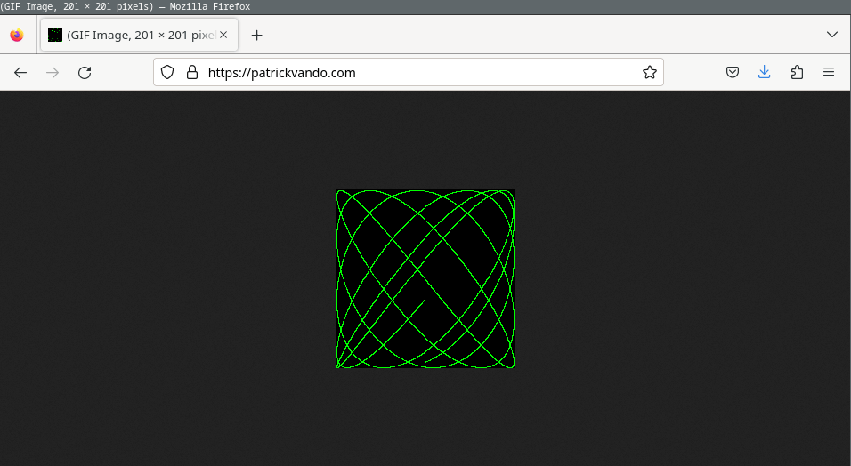

# Personal Website Infrastructure

This self contained project deploys a minimal set of AWS Infrastructure for hosting a personal website on an EC2 t2.nano instance with HTTPS. With the AWS free tier, hosting costs are around $40 per month.

The demo Go server code included is taken from the book *The Go Programming Language* by Alan A.A. Donovan and Brian W. Kernighan.



## Contents 

### PersonalWebsiteCDK

The CDK directory contains two stacks: 

 - `PersonalWebsiteCertStack`, which provisions the following
   - Route53 hosted zone
   - ACM Certificate for HTTPS
 
 - `PersonalWebsiteStack`, which provisions the following
   - VPC
   - ECS Cluster with a single t3.nano
   - EC2 Service with a single task
   - Application Load Balancer that requires HTTPS
   - HTTP target that redirects to HTTPS
   - DNS record targetting the ALB

### PersonalWebsiteGo

The Go directory contains an HTTP server that responds to requests with a dynamically generated Lissajous figure Gif.

## Prerequisites

Before getting started, please ensure that you have the following software versions installed:

- AWS CDK (Cloud Development Kit): Version 2.78 or later
  - Installation instructions: [AWS CDK Installation Guide](https://docs.aws.amazon.com/cdk/latest/guide/getting_started.html#getting_started_install)
  
- Node.js and npm (Node Package Manager): Version 9.5 or later
  - Installation instructions: [Node.js Downloads](https://nodejs.org/en/download/)

- Go Programming Language: Version 1.2 or later
  - Installation instructions: [Go Downloads](https://golang.org/dl/)

- AWS CLI (Command Line Interface): Version 1.27 or later
  - Installation instructions: [AWS CLI Installation Guide](https://docs.aws.amazon.com/cli/latest/userguide/cli-configure-quickstart.html#cli-configure-quickstart-awscli)

You will also need to have a [domain registered with AWS](https://docs.aws.amazon.com/Route53/latest/DeveloperGuide/domain-register.html).

## Deployment

```
export CDK_DEFAULT_ACCOUNT=youraccountnumberhere
export AWS_DEFAULT_REGION=us-west-2
export PERSONAL_WEBSITE_DOMAIN_NAME=yourwebsitehere.com
cdk deploy PersonalWebsiteStack
```

### First time deployment only

When deploying the `PersonalWebsiteCertStack` cloudformation stack for the first time, a new hosted zone will be created. You will need to update your Route53 registered domain to use the same Name Servers as those listed in the hosted zone CNAME record for the deployment to complete. 

## Useful commands

* `npm run build`   compile typescript to js
* `npm run watch`   watch for changes and compile
* `npm run test`    perform the jest unit tests
* `cdk deploy`      deploy this stack to your default AWS account/region
* `cdk diff`        compare deployed stack with current state
* `cdk synth`       emits the synthesized CloudFormation template